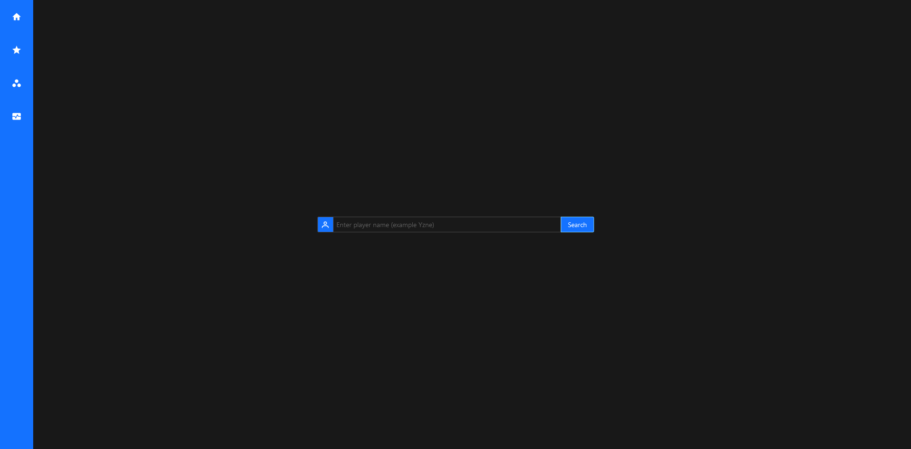
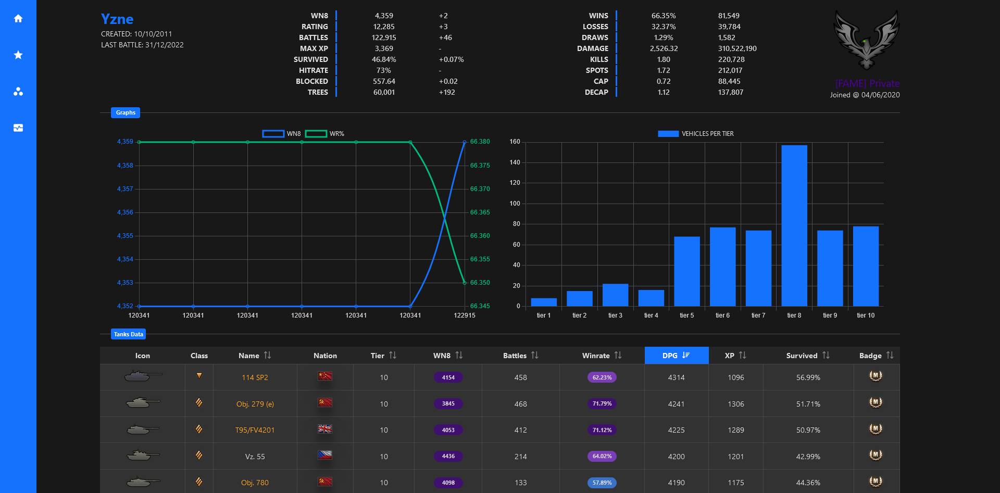
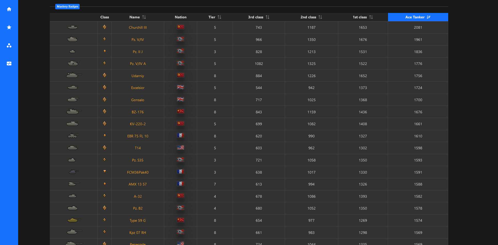
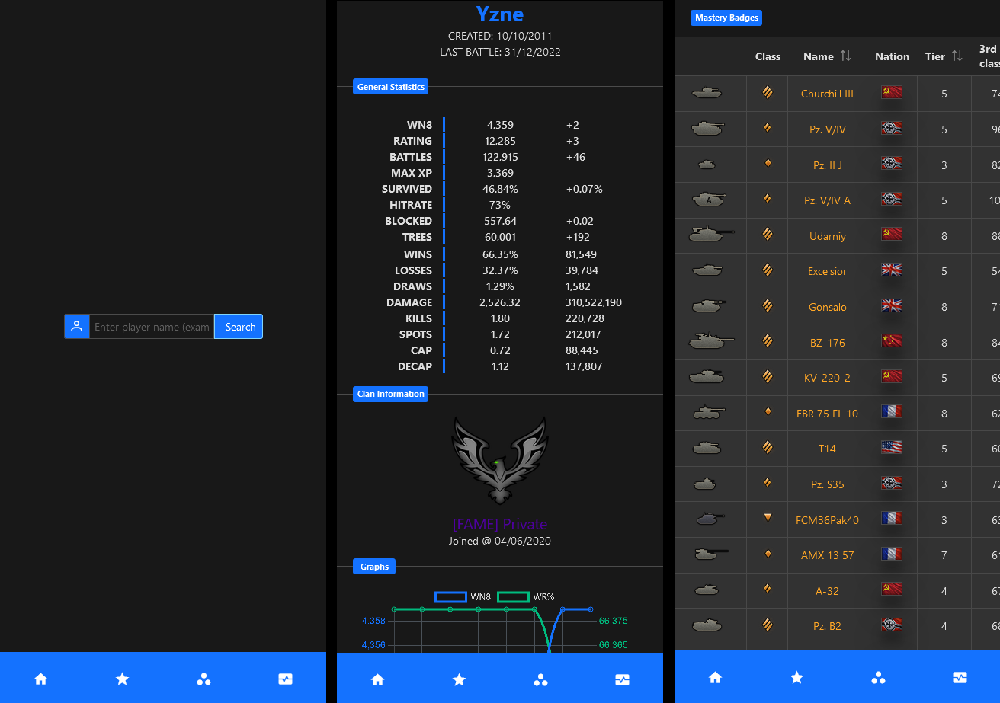

# wothub

Application, which calculates and displays World of Tanks player and tank statistics.

## Desktop View

  

## Mobile View



## Project Setup

```sh
npm install
```

### General Settings

Create `.env` file. Content example can be found in `.env.example`.

### Compile and Hot-Reload for Development

```sh
npm run dev
```

### Compile and Minify for Production

```sh
npm run build
```

### Lint with [ESLint](https://eslint.org/)

```sh
npm run lint
```
